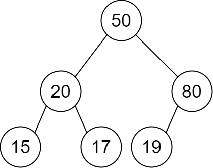
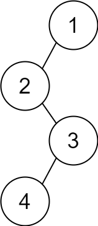

# 2196. Create Binary Tree From Descriptions: Problem

Source:
- LeetCode: https://leetcode.com/problems/create-binary-tree-from-descriptions/

This file uses a paraphrased problem statement instead of copying the full
prompt text from LeetCode.

## Problem Statement

You are given a list of descriptions for parent-child relationships in a valid
binary tree. Each description has the form:

```text
[parent, child, isLeft]
```

If `isLeft` is `1`, then `child` should become the left child of `parent`.
If `isLeft` is `0`, then `child` should become the right child of `parent`.

Build the binary tree described by all relationships and return its root.

## Examples

### Example 1



```text
Input: descriptions = [[20,15,1],[20,17,0],[50,20,1],[50,80,0],[80,19,1]]
Output: [50,20,80,15,17,19]
```

The root is `50` because it appears as a parent but never appears as a child.

### Example 2



```text
Input: descriptions = [[1,2,1],[2,3,0],[3,4,1]]
Output: [1,2,null,null,3,4]
```

The root is `1` because it has no parent in the descriptions.

## Constraints And Assumptions

- Each description contains exactly three integers.
- Node values are unique.
- `isLeft` is either `0` or `1`.
- The descriptions always form a valid binary tree.
- There is exactly one root.

## Edge Cases

- The root appears only as a parent and never as a child.
- Nodes may be introduced as children before their own children are described.
- The tree can be skewed, not just balanced.
- The input can contain many descriptions, so node lookup should be efficient.

## Visuals

The example diagrams are stored locally in `_md_images/` and were sourced from the
LeetCode problem page:

- `_md_images/example1drawio.png`
- `_md_images/example2drawio.png`

Original image URLs:

- https://assets.leetcode.com/uploads/2022/02/09/example1drawio.png
- https://assets.leetcode.com/uploads/2022/02/09/example2drawio.png
